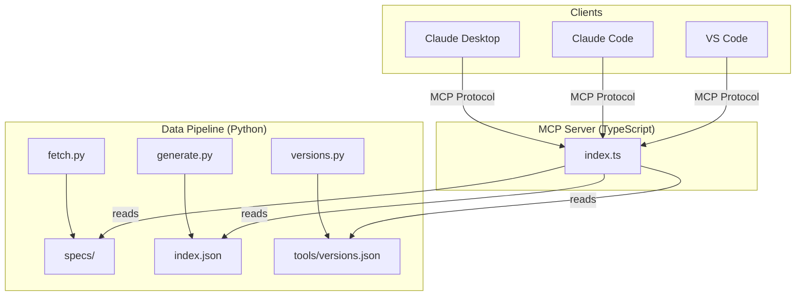
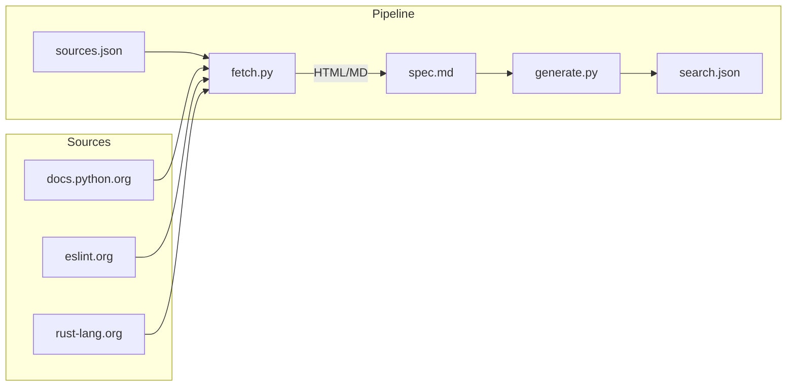
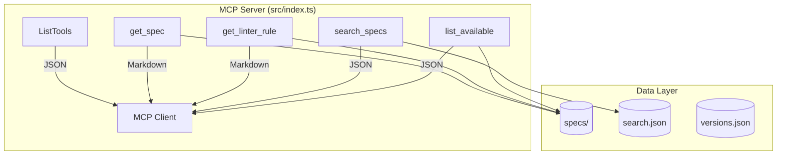
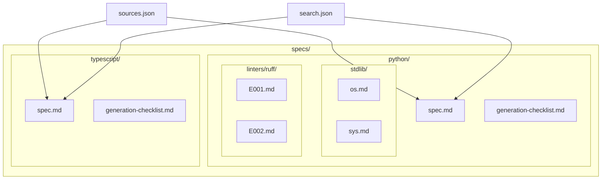
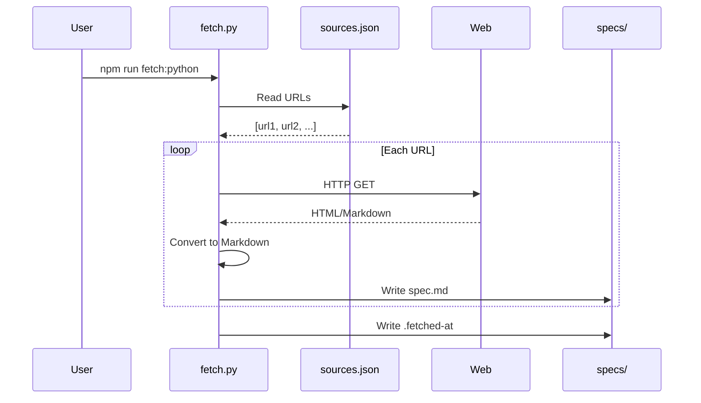
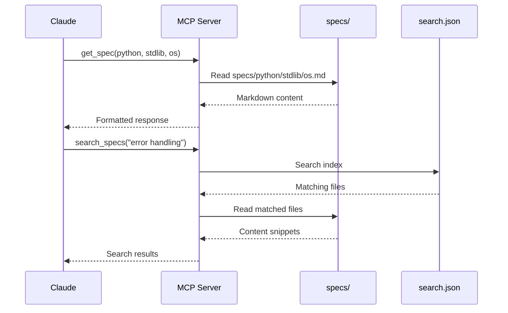
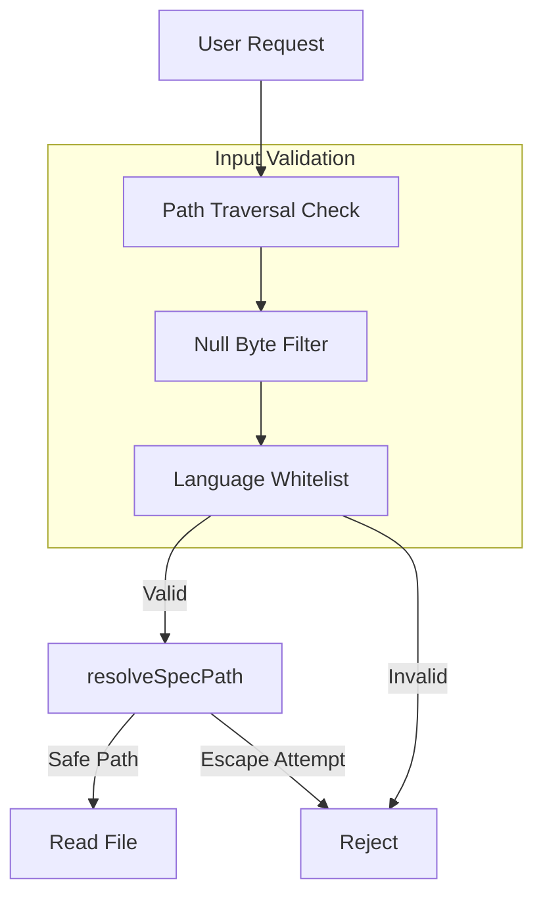

# SpecForge MCP Architecture

## System Overview

SpecForge MCP is a Model Context Protocol server that provides LLMs with authoritative language specifications. The system consists of three main components:



## Component Details

### 1. Data Pipeline (Python)

The data pipeline fetches, transforms, and indexes language specifications.



#### Core Scripts

| Script | Purpose | Coverage |
|--------|---------|----------|
| `_common.py` | Shared utilities (fetch, parse, log) | 97% |
| `fetch.py` | Data-driven spec fetcher | 100% |
| `generate.py` | Search index generator | 100% |
| `validate.py` | JSON schema validation | 100% |
| `versions.py` | Tool version management | 100% |

### 2. MCP Server (TypeScript)

Single-file MCP server implementing the Model Context Protocol.



#### MCP Tools

| Tool | Input | Output | Use Case |
|------|-------|--------|----------|
| `get_checklist` | language | markdown | Pre-coding rules |
| `get_spec` | language, category, topic | markdown | Spec lookup |
| `get_linter_rule` | language, linter, rule | markdown | Rule explanation |
| `search_specs` | query | JSON array | Cross-spec search |
| `list_available` | language, category | JSON array | Topic discovery |

### 3. Data Structure



## Data Flow

### Fetch Flow



### Query Flow



## Security Model



## Deployment

### Local Development

```bash
git clone https://github.com/krisarmstrong/language-specs-mcp.git
cd language-specs-mcp
npm install
npm run build
npm run refresh
npm test
```

### Production (Claude Desktop)

```json
{
  "mcpServers": {
    "SpecForge": {
      "command": "node",
      "args": ["/path/to/specforge-mcp/dist/index.js"]
    }
  }
}
```

## Performance Considerations

| Metric | Value | Notes |
|--------|-------|-------|
| Startup time | <100ms | Lazy loading of specs |
| Query latency | <10ms | File system cache |
| Memory usage | ~50MB | Index in memory |
| Spec count | 8,600+ files | 35 languages |

## Technology Stack

| Layer | Technology | Version |
|-------|------------|---------|
| Runtime | Node.js | 20+ |
| MCP SDK | @modelcontextprotocol/sdk | latest |
| Data Pipeline | Python | 3.11+ |
| Linting (Python) | ruff | latest |
| Linting (TypeScript) | biome | latest |
| Testing | pytest, node:test | - |

## Quality Metrics

| Metric | Target | Current |
|--------|--------|---------|
| Core Test Coverage | 95%+ | 97%+ |
| Linting Errors | 0 | 0 |
| URL Validity | 99%+ | 99.6% |
| Response Time | <50ms | <10ms |
